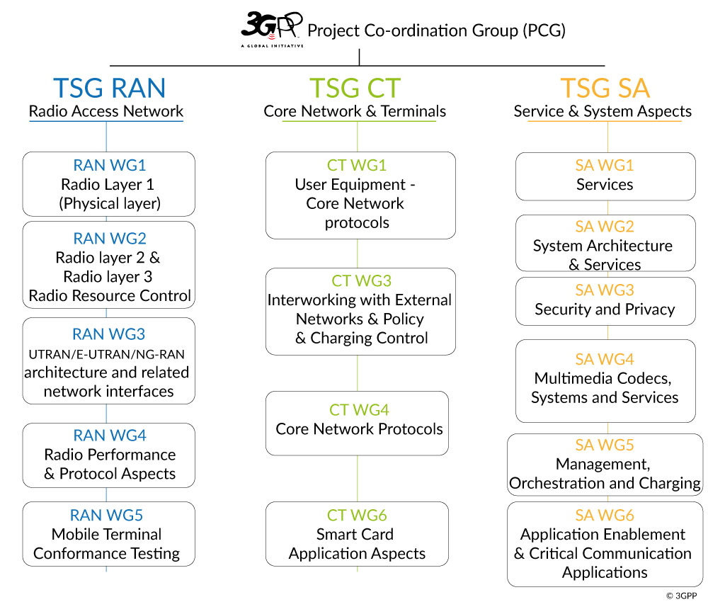
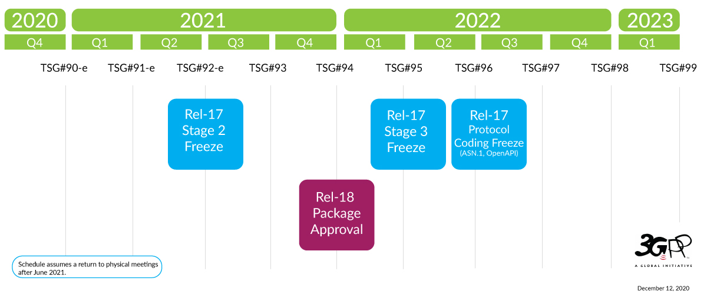

# 3GPP 與 3GPP 規格介紹

## 3GPP 簡介

參考 https://www.3gpp.org/about-3gpp/about-3gpp

3GPP 總共有三種技術標準化組織 [Technical Specification Groups](https://www.3gpp.org/specifications-groups) (TSG) ，包括：

- Radio Access Networks ([RAN](https://www.3gpp.org/RAN))
- Services & Systems Aspects ([SA](https://www.3gpp.org/SA))
- Core Network & Terminals ([CT](https://www.3gpp.org/rubrique34)) 

3GPP 組織主要負責制定以上 3 個部分的電信網路標準

## 3GPP 標準

### 為何需要技術標準？

電信網路中設備數量和種類眾多，只有當制定了了標準之後，各個電信網路設備製造商才可以按照標準各自生產網路設備，然後可以依照標準中定義的接口互相連通，之後便可以共同協作運行。這裡的設備不僅僅包含電信網路局端設備（運營商），也包括用戶端設備（UE，User Equipment），例如手機，IoT 設備等

標準不同的情況下，各家製造商生產的設備無法互相連通。便無法實現網路互通。因此標準定義十分重要

### 3GPP Release 規格介紹

參考 https://www.3gpp.org/releases

3GPP 使用名為 “Releases” 的命名方式，定期將一部分技術特性整理在某個指定版本中，並且允許在之後的版本中繼續增加新功能

例如  [TR 21.914](https://portal.3gpp.org/desktopmodules/Specifications/SpecificationDetails.aspx?specificationId=3179) covers Rel-14, [TR 21.915](https://portal.3gpp.org/desktopmodules/Specifications/SpecificationDetails.aspx?specificationId=3389) for Rel-15 and now [TR 21.916](https://portal.3gpp.org/desktopmodules/Specifications/SpecificationDetails.aspx?specificationId=3493) as the Rel-16 description document. 可以看出規律，TR.219xx，其中 xx 對應 Release-xx 中的 xx 部分

如下圖所示，這是最近的 Release 發佈時間表（寫稿時間為：2021-09-21）

在 https://portal.3gpp.org/#/55934-releases 可以查看所有 Release 標準的進度

### 規格的 stage

The term "Stage" derives from the ITU-T (originally CCITT) method for categorizing specifications ([Recommendation I.130](https://"http/www.itu.int/rec/T-REC-I.130/en/")).

stage 是來自 ITU-T（最初是 CCITT）組織在 I.130 標準建議書中提出的一種標準分類方法

- "Stage 1" refers to the service description from a service-user’s point of view.
  - stage 1 指的是從服務用戶的視角描述服務
- "Stage 2" is a logical analysis, devising an abstract architecture of functional elements and the information flows amongst them across reference points between functional entities.
  - stage 2 是邏輯分析與功能設計元素的抽象架構，以及功能實體之間的信息流參考點（此處描述比較抽象，需要藉助一個具體的標準文件進行解釋）
- "Stage 3" is the concrete implementation of the functionality and of the protocols appearing at physical interfaces between physical elements onto which the functional elements have been mapped.
  - stage 3 是功能和協定的具體實現，這些實現體在對應功能元件（一些物理元件）之間的物理通訊接口上

The mechanisms for creating and maintaining specifications are described in [TR 21.900](https://www.3gpp.org/DynaReport/21900.htm). A presentation outlining the release and change request process can be found [here.](https://www.3gpp.org/FTP/Inbox/2008_web_files/The_change_control_cycle.ppt)

在 TR 21.900 中描述了這些規範的創建和維護機制

### 規格的命名

https://www.3gpp.org/specifications/specification-numbering

所有 3GPP 規格都有一個由 4 到 5 位數字的規格名稱（例如 09.02 或者 29.002）

前 2 位數字定義規格所屬的系列，後面緊跟著 01 至 13 系列對應的 2 個數字，或者 21 至 55 系列的 3 位數字

