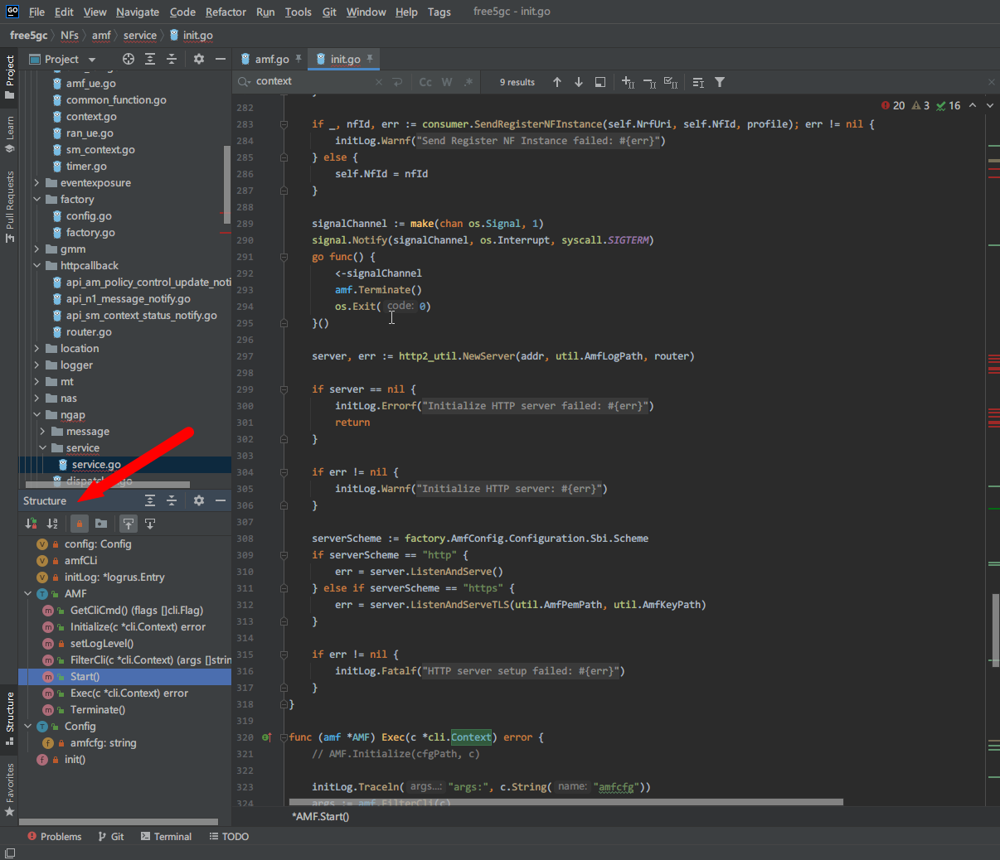

# Free5GC Code Tracing

the code tracing below is based the project in GitHub which repo URI is [free5gc/free5gc](https://github.com/free5gc/free5gc) and **version is [v3.0.5](https://github.com/free5gc/free5gc/releases/tag/v3.0.5)**
you can fetch **all source code** which version is `v3.0.5` by these command
``git clone --recursive -b v3.0.5 -j `nproc` https://github.com/free5gc/free5gc.git``

## Introduction

### What is free5GC?

The free5GC is an open-source project for 5th generation (5G) mobile core networks. The ultimate goal of this project is to implement the 5G core network (5GC) defined in 3GPP Release 15 (R15) and beyond.

Currently, the major contributors are with National Chiao Tung University (NCTU). Please refer to our roadmap for the features of each release.

refer to https://github.com/free5gc/free5gc#readme

## Environment

- Golang 1.15.x
- Ubuntu Server 20.04 LTS

## Future Work

- unified the **identity(variable) naming rule**
    - for searching optimize by IDE(code editor) and coding reformat
- optimize the coding style by theory based **software design pattern** including these methods:
    - extract some codes from a big function to some small functions. 
        - Why we need do this? 
            - Because many IDEs and code editors like Goland, VSCode, Eclipse have a panel names "Structure", the UI screenshot is at below:
                - 
            - We can easily watch all functions in the panel, so we can quickly understand what functions are included in the code and its role or duty in the Network Function(NF) by the function name, but not only a Start() function(We can't quickly understand what actions are done in the Start() function unless tracing every code line in this function)
            - We can easily test many small functions by automatic unit test framework like [gotest](https://books.studygolang.com/The-Golang-Standard-Library-by-Example/chapter09/09.1.html), so we could develop new features and refoactor old codes efficienly.
    - move the hard-code and magic number to the configuration or constant with description comment
- refactor the **directory structure**
    - We can quickly understand the role of files, and locate the bugs quickly 
- optimize the **performance**
    - TODO
- add **some comment** for coding analysis friendly
    -  we can generate the application documentation by [`go doc`](https://golang.org/doc/) and API documentation by `swagger`, and we can easily test the HTTP RESTful API in the [swagger-ui](https://swagger.io/tools/swagger-ui/)
